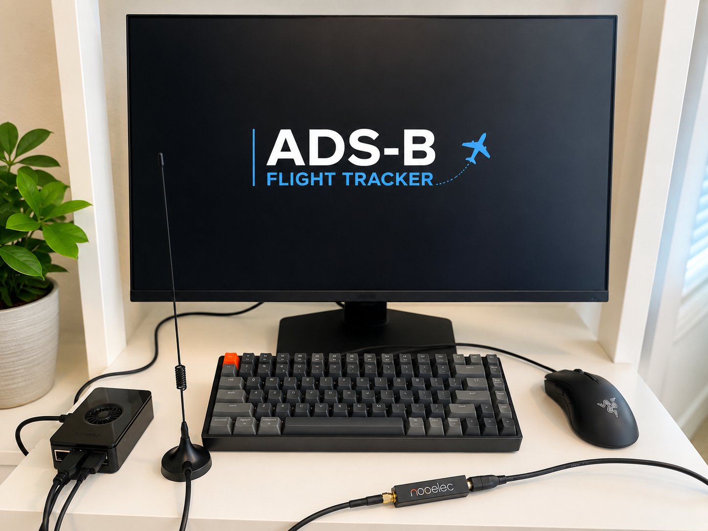

# ADS-B Aircraft Tracking Station

I built an ADS-B aircraft tracking station using a Raspberry Pi 5 and an RTL-SDR receiver to monitor live aircraft transmissions.

The system receives 1090 MHz ADS-B signals from nearby aircraft, decodes them with readsb, and displays real-time flight information through the tar1090 web interface.

This project gave me hands-on experience with software defined radio (SDR), Linux, RF communications, networking, and integrating hardware and software into a working system.

## Project Overview

For this project, I used a Raspberry Pi 5 and an RTL-SDR receiver to capture ADS-B transmissions broadcast by nearby aircraft at 1090 MHz. The signals are decoded with readsb and displayed through the tar1090 web interface, where I can view aircraft positions, altitude, speed, heading, and identification information in real time.

My goal was to learn more about software defined radio, Linux configuration, and RF communications. Throughout the project, I configured the software, verified the hardware, troubleshot connection issues, and got everything working together as a functional aircraft tracking station.

## Skills Demonstrated

- Raspberry Pi
- Linux
- Software Defined Radio (SDR)
- RF Communications
- TCP/IP Networking
- System Integration
- Command Line
- Hardware Troubleshooting
- Embedded Linux
- System Configuration
- Network Configuration
- Technical Documentation

## Hardware

| Component | Purpose |
|-----------|---------|
| Raspberry Pi 5 | Runs Raspberry Pi OS, readsb, and the tar1090 web interface |
| Nooelec NESDR Smart v5 | Receives 1090 MHz ADS-B transmissions |
| MicroSD Card | Stores Raspberry Pi OS |
| Power Supply | Powers the Raspberry Pi |
| USB Extension (optional) | Reduces RF interference |
| 1090 MHz Antenna | Receives aircraft signals |

## Hardware Setup

<p align="center">
  
</p>

## Software

- readsb
- tar1090
- lighttpd
- git
- raspberry pi OS

### Operating System

- Raspberry Pi OS (64-bit)

### Packages

- readsb
- tar1090
- rtl-sdr
- lighttpd
- git

### Installation

```bash
sudo apt update
sudo apt upgrade
sudo apt install git
```
wget https://flightaware.com/adsb/piaware/files/packages/pool/bookworm/piaware-repository_11.0_all.deb
...

### Configuration

Verified RTL-SDR detection using rtl_test

Confirmed the readsb service was active

Verified aircraft reception through the tar1090 web interface

Accessed the receiver remotely using the Raspberry Pi IP address

Confirmed tar1090 web interface was reachable

Verified automatic startup after reboot

## System Design

```text
+-----------+
| Aircraft  |
+-----------+
      │
1090 MHz RF
      ▼
+-----------+
| Antenna   |
+-----------+
      │
      ▼
+-----------+
| RTL-SDR   |
+-----------+
      │ USB
      ▼
+--------------+
| Raspberry Pi |
+--------------+
      │
      ▼
+--------------+
|    readsb    |
+--------------+
      │ HTTP
      ▼
+--------------+
|   tar1090    |
+--------------+
      │
      ▼
+--------------+
| Web Browser  |
+--------------+
```

The way the system works is pretty straightforward. Aircraft continuously broadcast ADS-B messages on 1090 MHz, and the antenna picks up those signals. The RTL-SDR receives the RF data and sends it to the Raspberry Pi over USB, where readsb decodes the messages. Tar1090 then displays that information in a web browser so I can view nearby aircraft in real time from any device on my local network.

## Build Guide

### 1. Install Raspberry Pi OS

I started by flashing the latest 64-bit version of Raspberry Pi OS to a microSD card using Raspberry Pi Imager. After installing the card in the Raspberry Pi, I completed the initial setup and connected it to my network.

---

### 2. Update the Raspberry Pi

Before installing anything else, I updated the operating system and installed Git.

```bash
sudo apt update
sudo apt upgrade -y
sudo apt install git
```

---

### 3. Connect the RTL-SDR

Next, I connected the Nooelec NESDR Smart v5 to the Raspberry Pi and attached the 1090 MHz antenna. To make sure the SDR was recognized correctly, I ran:

```bash
lsusb
```

I verified that the RTL2838-based SDR device appeared in the list before moving on.

---

### 4. Install and Configure readsb and tar1090

After confirming the hardware was working, I installed readsb to decode ADS-B messages and tar1090 to display the aircraft data through a web interface.

Once everything was installed, I verified that the readsb service was running.

```bash
sudo systemctl status readsb
```

---

### 5. Verify Aircraft Reception

With the software running, I opened the tar1090 interface in my browser.

```
http://<RaspberryPi-IP>/tar1090
```

Once nearby aircraft started appearing on the map, I knew the system was successfully receiving and decoding ADS-B transmissions.

I also verified that readsb was actively receiving messages from the terminal.

```bash
journalctl -u readsb -f
```

---

### 6. Access the System from Another Device

To make sure everything was working across my local network, I found the Raspberry Pi's IP address.

```bash
hostname -I
```

Then, from another device connected to the same Wi-Fi network, I opened:

```
http://<RaspberryPi-IP>/tar1090
```

This let me access the same live aircraft map from another computer without needing to connect directly to the Raspberry Pi.

## Results

After getting everything running, I was able to receive and decode live ADS-B transmissions from aircraft around the Portland area.

<p align="center">
  
</p>

## Troubleshooting

## Future Improvements

- Install an outdoor 1090 MHz antenna
- Add a low-noise amplifier (LNA)
- Increase reception range
- Feed data to FlightAware
- Log aircraft data to a database
- Build a custom enclosure
- Design a custom PCB for SDR power filtering

## License

